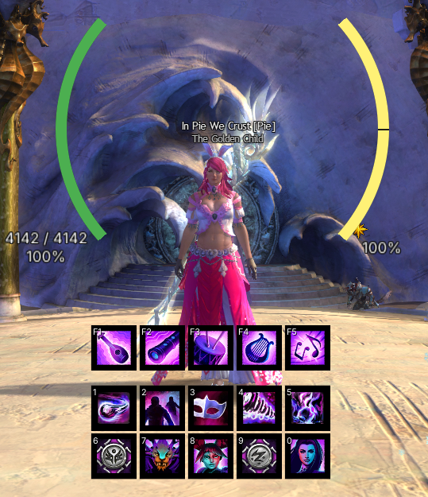

# Pie UI

A [Raidcore Nexus](https://raidcore.gg/Nexus) addon for Guild Wars 2 that replaces native HUD elements with configurable, better-looking alternatives. All game-memory access is strictly read-only.

## AI Notice

This addon has been largely created using Claude. I understand that some folks have a moral, financial or political objection to creating software using an LLM. I just wanted to make a useful tool for the GW2 community, and this was the only way I could do it.

If an LLM creating software upsets you, then perhaps this repo isn't for you. Move on, and enjoy your day.

## Screenshots

## Features

### Player vitals
- HP, barrier, and endurance in four styles: **horizontal bar**, **vertical bar**, **reticle arcs**, and **reticle ring**.
- Live HP/endurance/barrier numbers with a 3-stop HP colour gradient (green → amber → red).
- Barrier shown as a separate strip or overlaid — always visible, even at full HP.
- **Mount aware:** the bar tracks mount dodge endurance while mounted, with per-mount dodge segments, and shows the Skyscale's flight stamina.
- Every colour is configurable.

### Skill bars
- Live weapon and utility skill icons that follow weapon swaps, kits, transforms, and bundles automatically.
- **Cooldown sweeps** with countdown numbers and grey-out.
- **Click-to-cast** — click a skill to fire it; press-and-hold works for channelled skills (e.g. Siege Turtle jets).
- Keybind labels on each slot, fully rebindable in-app.
- Activation flash and combo/flip animations.
- Separate, independently placeable groups for weapons and utilities.

### Profession & pet bars
- **Profession bar** (F1–F7) that auto-fits your specialisation's mechanics.
- **Pet / mech control bar** for Rangers and Mechanists: live pet skills with cooldowns, a creature HP bar, and command buttons (attack, return, swap, combat toggle).
- Optional pet HP readout on the reticle HUD, beside your own health.

### Mounted hotbar
- Per-mount skill layouts with the correct icons and keybind labels, shown automatically while mounted.

### General
- A clean settings window (open via keybind, the quick-access tray icon, or the Nexus options panel) with per-subsystem tabs and colour pickers.
- Drag-to-place and resize any widget in unlock mode, with snap-to-grid.
- Show widgets only in combat (with an escape hatch to keep them while mounted).
- Everything hides automatically on loading screens, character select, and the world map.
- Settings persist in a versioned `pieui.json` that survives updates.

## Hiding the native UI

Pie UI draws *replacements*, not overlays that erase the originals. To hide a native element and drop a Pie UI widget in its place, use the game's own **Options → UI → Dynamic HUD** (covers the skill bar, health orb, compass, target, party, chat, and more). This keeps the addon policy-safe and avoids touching the game's render path.

## Installation

Requires the [Nexus](https://raidcore.gg/Nexus) host. Copy `PieUI.dll` into your `<Guild Wars 2>/addons/` folder and (re)load it from the Nexus addon list.
