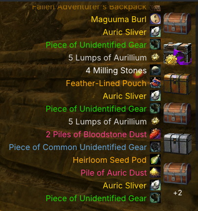

# Pie UI

**Replace Guild Wars 2's native HUD with cleaner, fully configurable, better-looking elements** — player vitals, skill bars, target and squad frames, a full chat box, a minimap, and a lot more. A [Raidcore Nexus](https://raidcore.gg/Nexus) addon.

Pie UI only **reads** game memory and triggers actions through the game's own input and interface paths — it never writes to, modifies, or automates the game. See the [Addon Policy](#addon-policy) for how it stays within ArenaNet's guidelines.

## Highlights

- **Player vitals and skill bars** in different styles, with live cooldown timers and click-to-cast.
- **Profession mechanics** — an F1–F7 bar, pet and mech control, and a resource bar for every profession.
- **Boon, condition and effect bars** with stack counts and countdowns.
- **Target frame** with a break bar, class icon, and a right-click player menu.
- **Squad and party frames** with subgroup columns, commander tags and live health.
- **Minimap** with waypoint travel, resource nodes and live squad dots.
- **Content Guide** — nearby events, hearts, your story step and tracked achievements, plus a map meta panel.
- **Replacement chat box** with clickable links, inline emoji and a per-contact messenger.
- **Loot Cascade, toasts and the reward tray**, redrawn in your theme and placed where you want them.
- **Themes, your own fonts and drag-to-place everything**, with one-click hiding of the native element each widget replaces.

Every element is described below, and each one can be turned off.

<b>More screenshots</b>

## What each element does

Click to expand

### Player vitals
HP, barrier and endurance in several styles: horizontal bar, vertical bar and reticle arcs. Live numbers with a health colour gradient, a clear downed warning, and every colour configurable. It follows what you are doing, so it tracks mount dodge endurance while mounted and your stamina while gliding.

### Skill bars
Your weapon and utility skills with live icons that follow weapon swaps, kits, transforms and bundles by themselves, plus cooldown sweeps with countdowns, compact keybind labels and click-to-cast. Weapons and utilities are placed independently, and a weapon-swap button mirrors the native one. You can also swap a utility skill straight from the bar with a right-click, without opening the Hero panel.

### Cast bar
Shows the skill you are casting and its name, and fills for the things that are not skills too: opening a chest or gathering a node. It runs on the game's own timing, so it speeds up under quickness exactly as the native bar does.

### Loot Cascade
Pie UI's version of the pickup list that runs up the side of the screen, in your theme and wherever you put it. Items appear in rarity colour with the game's own art and wording, and the list moves like the game's own: quiet pickups drift, a trophy flood moves fast and drains as it clears. Hover any row for the full item tooltip plus how many you already own across bags, bank and material storage.

### Notification toasts
The pop-ups the game shows for achievements, rewards, unlocks and level-ups, redrawn in your theme at a size and position you choose. They stay clickable and do what the native ones do: an achievement opens the achievement panel at that achievement, a skin or outfit opens the game's own preview.

### Reward tray
The chest-and-reward row the game shows after an event or a meta, in your theme and freely placed like everything else. The rows still open and claim exactly as native's do.

### Item right-click menu
Pie UI adds its own rows to the game's own right-click menu on any item in your inventory, bank or material storage: search the wiki in your game's language, copy the name, or copy the chat code. A Hoard & Seek search appears too when that addon is installed.

### Nameplate class icons
Profession and elite-specialisation icons drawn onto the game's own nameplates, so you can read a crowd at a glance. Two art styles, gold or tango, with size, opacity, draw distance and placement all configurable.

### Profession & pet bars
An F1–F7 profession bar that fits your specialisation's mechanics automatically, including the native-style highlight on an Elementalist's active attunement. Rangers and Mechanists get a pet or mech bar as well, with live skills and cooldowns, a creature health bar and the full set of commands.

### Profession resource bar
A positionable bar for your specialisation's core resource, drawn as a smooth fill or segmented pips in a colour you choose. **Every profession has one**, and it follows your elite specialisation, so it shows the right thing whether that is life force, initiative, adrenaline, energy, heat or a specialisation's own mechanic. Specs with a second resource get it alongside, and Revenants also get a native-style legend bar with the swap cooldown on the active legend.

### Mounted hotbar
The right skills for whichever mount you are on, with the correct icons and keybind labels, shown automatically while mounted. Skills you have not unlocked the mastery for are hidden rather than shown dead, so the bar matches what you can actually use.

### Mount, novelty & mastery buttons
Pie UI versions of the native always-on buttons, each placeable and themed like the rest of the HUD. Every picker lists only what your account actually owns, and the mastery button hides itself when there is no mastery skill to use.

### Boon, condition & effect bars
Your live effects across three independently placeable sections: boons, conditions, and everything else. Show icons, duration bars or both, with stack counts and countdowns, and set orientation and wrapping per section. Food and utility buffs appear with their own nourishment icons, including the reminders that nudge you to re-buff.

### Target frame
Your target's health with attitude colouring and a native-style defiance and break bar. It names the target and shows their level or mastery rank, class and elite-spec icon, and a skills or title line, and it works on creatures, objects and gadgets as well as players. Right-click a player target for whisper, party and squad actions, and turn on optional floating strips for the target's boons and conditions.

### Squad & party frames
A movable, resizable roster for your party or squad, as a list or a native-style grid, with colour-coded subgroup columns for squads. Each member shows their class, name, commander tag and live health, and ready checks and vote-to-kick prompts arrive on the frames so you can answer without hunting for the native prompt. *Health is read-only and PvE-only. Requires the **RealTime API** (RTAPI) addon from the [Nexus](https://raidcore.gg/Nexus) library, which supplies the roster.*

### Minimap
A clean, positionable minimap that draws what the game's own compass draws: resource nodes, live service markers, event boundary rings, waypoints, points of interest and map-completion markers, with a floor system that follows you between levels and into caves. Click a waypoint to travel, alt-click to drop the game's own personal marker, save any spot as a named bookmark with an emoji of your choice, and see your party, squad and guild live, commander markers included. A one-click Farming Overlay strips it back to a transparent, click-through node radar you can park over your reticle. *Map-completion markers grey out until you complete them, which is read from the optional [Hoard & Seek](https://raidcore.gg/Nexus) addon; without it they stay grey. Map art is read from your own game files where possible, which needs the `-shareArchive` launch option — see [Installation](#installation).*

### Content Guide
A panel mirroring the game's own event guide: what is happening around you right now, with live objectives, countdowns and meta groupings, displayed the way the game displays them. It also carries the renown hearts near you, your current story step, your tracked achievements with live progress, whatever festival is running, and your fractal status when you are in one. Click an achievement to open the game's own panel at it.

### Map meta panel
The tiered meta bar and your participation bar for the map you are on, in a movable window with the usual pin and opacity controls. It draws only when the game says the map has a meta, so there is no map list to maintain and nothing to fall out of date.

### Bottom-line strip
A configurable status strip of live readouts: performance and ping, where you are, your character, level, mount, XP, your wallet, clocks, and your active build and gear. You can switch build and gear templates straight from the strip with no panel to open. Choose which readouts appear, arrange them left, centre or right, and colour each one.

### Replacement chat box
A movable, resizable chat panel with a fully interactive tab strip: rename tabs, choose which channels each one shows, drag to reorder, and see unread badges. Lines are rich and clickable, with live tooltips on item and skill links, guild tags and class icons on senders, and account names on hover. Sending is built in, including whispers, with a right-click menu on any name for the full set of player actions, and inline emoji by shortcode with a searchable picker.

### Tyrian IM — built-in messenger
A per-contact whisper messenger with a conversation list, chat bubbles, a reply box and history saved to disk. A floating icon bobs and flashes with an unread badge, and right-clicking a name in the chat box opens that conversation straight away.

### Quick-toggle bar & native-UI hiding
Every Pie UI widget can hide the native element it replaces, and a floating quick-toggle bar lists them side by side so you can show or hide either with a single click. In WvW and PvP the native elements are kept up automatically, so you are never left without a HUD. Pie UI draws replacements rather than erasing the originals, and hiding goes through the game's own interface, never the render path.

### General
A clean settings window with per-subsystem tabs, opened by keybind, tray icon or the Nexus options panel. Drag to place and resize anything in unlock mode, save whole arrangements as named Layout Profiles and have Pie UI switch between them automatically for fractals, raids or competitive maps, and set per-feature opacity for in and out of combat. You can use your own TrueType fonts, and Pie UI's widgets clip out of any open Guild Wars 2 panel instead of drawing across it. Settings live in a versioned file that survives updates, and if the game ever crashes Pie UI writes a report naming what faulted, recording addresses and file names only.

## Installation

Requires the [Nexus](https://raidcore.gg/Nexus) host. Copy `PieUI.dll` into your `<Guild Wars 2>/addons/` folder and (re)load it from the Nexus addon list.

**Game artwork:** Pie UI gets some of its art directly from the game. This requires that the game is launched with the `-shareArchive` command line option. **Without it, some art may be missing, such as icons or map tiles.** `-shareArchive` is an ArenaNet option, not invented by Pie UI — see [Command line arguments](https://wiki.guildwars2.com/wiki/Command_line_arguments) on the official wiki. Pie UI also explains this on first run.

**Companion addon (recommended):** chat **item, skill and skin** names and tooltips are resolved by the separate [Decoder Ring](https://github.com/PieOrCake/decoder_ring) addon. Pie UI works fine without it — those links just fall back to generic `[Item]` / `[Skill]` / `[Skin]` labels until Decoder Ring is installed. Waypoint, build-template, wardrobe-template and URL links work either way.

## Addon Policy

Pie UI reads game memory to mirror information Guild Wars 2 already shows you, and triggers actions only through the game's own input and interface paths. It never surfaces anything you couldn't get from the native UI, automatically disables its combat-relevant overlays in **PvP and WvW**, and keeps its source closed to avoid providing a cheat template. It is designed to operate within ArenaNet's [Third-Party Programs](https://help.guildwars2.com/hc/en-us/articles/360013625034-Policy-Third-Party-Programs) and [Macros & Macro Use](https://help.guildwars2.com/hc/en-us/articles/360013762153-Policy-Macros-and-Macro-Use) policies.

Full policy details

### Data Parity

Pie UI never surfaces information you couldn't already get from the native UI:

- **Other players' health** (squad and party frames) is shown only as a bar and, optionally, a whole-number percentage — never a raw current/maximum value.
- **Barrier, boons and conditions** are shown the same way the native frames show them — bar, duration and stacks.
- **Your own** character's detailed readouts (exact resource values and so on) are your own data and are shown in full.

### Mode Restrictions

In competitive zones — PvP and WvW — Pie UI automatically disables its combat-relevant overlays (vitals, hotbars, target frame, resource bars, effect bars, minimap and squad/party frames) and restores the native UI, so it can never give an advantage over other players.

### Memory Access

To avoid providing a ready-made template for cheats, the source code is not public.

### Disclaimer

While every effort is made to keep Pie UI within ArenaNet's current policies, the use of any third-party software is at the sole discretion of the player. The developer of this addon is not responsible for any actions taken against your account. ArenaNet's policies are subject to change without notice; stay informed and decide for yourself whether you are comfortable with the risks of using third-party programs.

## AI Notice

This addon has been largely created using Claude. I understand that some folks have a moral, financial or political objection to creating software using an LLM. I just wanted to make a useful tool for the GW2 community, and this was the only way I could do it.

If an LLM creating software upsets you, then perhaps this repo isn't for you. Move on, and enjoy your day.

## For addon developers

Pie UI exposes a small, optional cross-addon API over the Nexus event bus:

- **Open a chat link** — hand Pie UI any `[&...]` chat link and it performs that link's native action: open and pan the world map to a waypoint, open the Wardrobe Template or build window, or preview an item / skin.
- **Match its theme** — Pie UI broadcasts its full active ImGui colour palette (plus a signature accent colour) so your addon can match its look automatically, updating whenever the user changes theme or trim.

Both are optional no-ops when Pie UI isn't installed, so you never need a hard dependency. See **[INTEGRATION.md](INTEGRATION.md)** for the event contracts and worked examples; the event names and the theme struct are published in **[PieUiAPI.h](PieUiAPI.h)**, with a browsable reference at **[the API docs](https://pieorcake.github.io/pie_ui/)**.

## Requests and known gaps

Every native always-on HUD element now has a Pie UI replacement. What is left is parity polish inside
those elements, tracked as [issues on the repo](https://github.com/PieOrCake/pie_ui/issues) — that is
also the place to ask for something, or to tell me what is broken.

## Credits

Pie UI is built with the help of these third-party libraries, tools and assets:

- **[Dear ImGui](https://github.com/ocornut/imgui)** by Omar Cornut — the immediate-mode GUI that renders Pie UI's in-game interface. (MIT)
- **[nlohmann/json](https://github.com/nlohmann/json)** — JSON parsing for settings storage. (MIT)
- **[Nexus](https://github.com/RaidcoreGG/Nexus)** by Raidcore — the addon host platform Pie UI runs on, which also provides **[MinHook](https://github.com/TsudaKageyu/minhook)** (BSD-2-Clause) for safe game-function hooking.
- **[Twemoji](https://github.com/jdecked/twemoji)** (jdecked fork) — the inline chat emoji graphics (© Twitter, Inc. and contributors, licensed [CC-BY 4.0](https://creativecommons.org/licenses/by/4.0/)), fetched on demand from a CDN.
- **[gemoji](https://github.com/github/gemoji)** — `:shortcode:` name data for the chat emoji. (MIT)
- **Guild Wars 2 API & Wiki** — item, map and icon data is sourced from the official [Guild Wars 2 API](https://wiki.guildwars2.com/wiki/API:Main) and the [Guild Wars 2 Wiki](https://wiki.guildwars2.com/). This includes the menu launcher's panel icons and the minimap's event and map icons, which are Guild Wars 2 game art © ArenaNet.
- **[assets.gw2dat.com](https://assets.gw2dat.com/)** — icons the game refers to by file id (event, marker and map art) are fetched from this community asset host when they are not already available locally. The artwork is Guild Wars 2 game art © ArenaNet.
- **[tiles.guildwars2.com](https://tiles.guildwars2.com/)** — ArenaNet's own map tile service, used for minimap tiles that aren't read from your local game archive.

Guild Wars 2 and all related assets are © [ArenaNet, LLC](https://www.arena.net/) and NCSOFT Corporation. Pie UI is an unofficial, fan-made addon and is not affiliated with or endorsed by ArenaNet.
