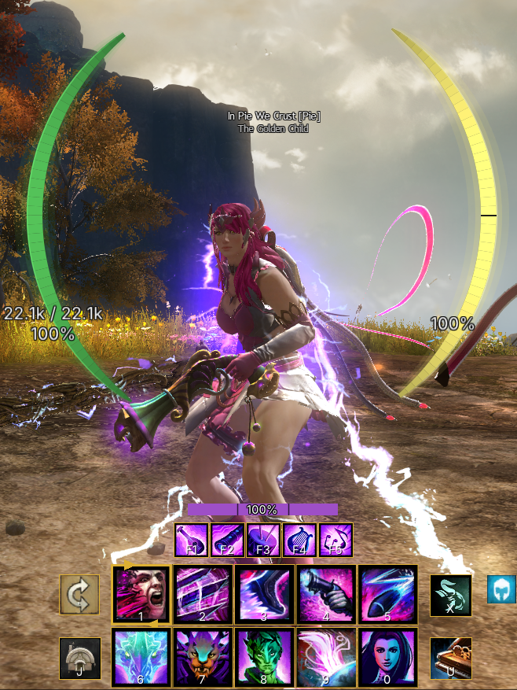
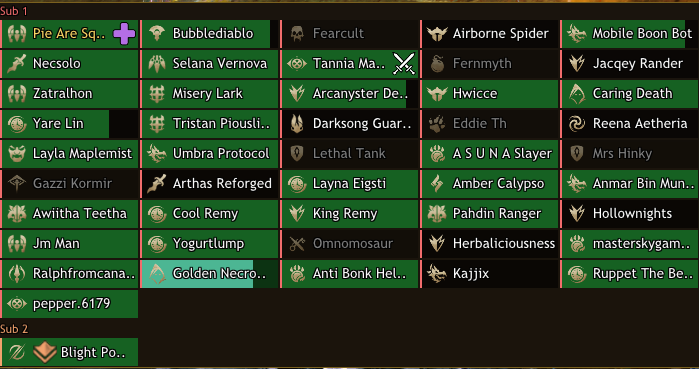
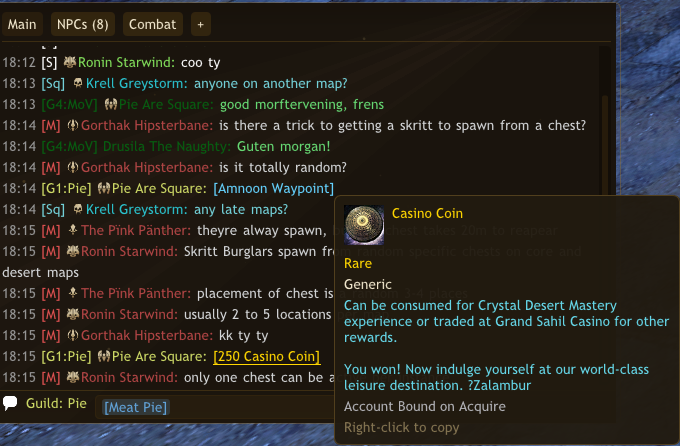
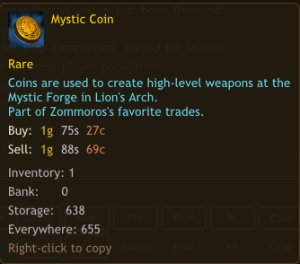
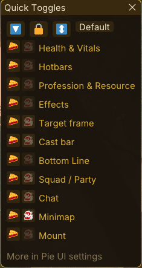
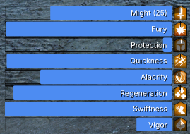
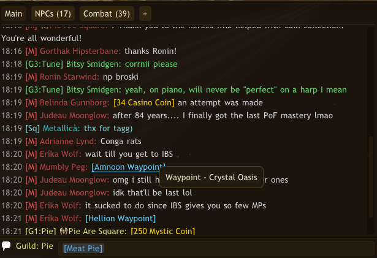
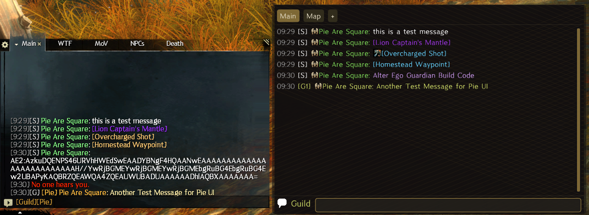

# Pie UI

**Replace Guild Wars 2's native HUD with cleaner, fully configurable, better-looking elements** — player vitals, skill bars, target and squad frames, a full chat box, a minimap, and a lot more. A [Raidcore Nexus](https://raidcore.gg/Nexus) addon.

Pie UI only **reads** game memory and triggers actions through the game's own input and interface paths — it never writes to, modifies, or automates the game. See the [Addon Policy](#addon-policy) for how it stays within ArenaNet's guidelines.

## Highlights

- **Player vitals & skill bars** — HP, barrier and endurance in four styles, live cooldown sweeps with countdowns, and **click-to-cast**.
- **Profession mechanics** — an auto-fitting F1–F7 profession bar, pet / mech control, and **per-specialisation resource bars for every profession**.
- **Boon, condition & effect bars** — your live effects across three placeable sections, with stack counts and countdowns.
- **Target frame** — health, attitude colouring, a defiance / break bar, the target's name, level or mastery rank, class / elite-spec icon, a right-click player menu, and optional floating bars for the **target's boons and conditions**.
- **Squad & party frames** — a styled roster with colour-coded subgroup columns, commander tags, and live (PvE) health bars.
- **Minimap** — live map-service markers read from the game itself, resource-node markers, a floor / layer system, click-a-waypoint travel, live party / squad / guild dots, and the commander's **squad markers**.
- **Content Guide** — a nearby-events panel mirroring the game's own, with live objectives and countdowns, renown hearts, your story step, tracked achievements and bonus events.
- **Nameplate class icons** — profession and elite-spec icons drawn on the game's own nameplates, in gold or tango style.
- **Replacement chat box & Tyrian IM** — interactive tabs, clickable links with rich tooltips, inline emoji, built-in whisper sending, **right-click to mail or report a player**, and a per-contact messenger.
- **Themes, custom fonts, quick-toggles & native-UI hiding** — drag-to-place widgets, **your own TrueType fonts**, per-feature opacity, theme-coloured chrome, and one-click hiding of the native element each widget replaces.
- **Stays out of the way** — Pie UI's widgets clip behind open Guild Wars 2 windows instead of drawing across them.

<b>More screenshots</b>

## AI Notice

This addon has been largely created using Claude. I understand that some folks have a moral, financial or political objection to creating software using an LLM. I just wanted to make a useful tool for the GW2 community, and this was the only way I could do it.

If an LLM creating software upsets you, then perhaps this repo isn't for you. Move on, and enjoy your day.

## Full feature list

Click to expand every feature

### Player vitals
- HP, barrier, and endurance in four styles: **horizontal bar**, **vertical bar**, **reticle arcs**, and **reticle ring**.
- Live HP/endurance/barrier numbers with a 3-stop HP colour gradient (green → amber → red).
- Barrier shown as a separate strip or overlaid — always visible, even at full HP.
- **Downed warning:** the HP bar turns red with a deep-red border the moment you're downed, whatever your health was.
- **Mount & glider aware:** tracks mount dodge endurance (with per-mount dodge segments) while mounted, the Skyscale's flight stamina, and your **glider stamina** while gliding.
- Every colour is configurable.

### Skill bars
- Live weapon and utility skill icons that follow weapon swaps, kits, transforms, and bundles automatically.
- **Cooldown sweeps** with countdown numbers and grey-out.
- **Click-to-cast** — click a skill to fire it; press-and-hold works for channelled skills (e.g. Siege Turtle jets).
- **Compact keybind labels** on each slot (`Shift+1` shows as `S+1`), fully rebindable in-app.
- Activation flash and combo/flip animations, plus **theme-coloured slots** with an accent cooldown sweep and an activation glow.
- A **weapon-swap / stow button** that mirrors the native one, with its recharge (and the right behaviour per profession).
- Separate, independently placeable groups for weapons and utilities.
- A **cast bar** showing the skill you are currently casting, with its name.
- A sustained **"ability is running"** cue, and a slot flash when a skill actually fires rather than when you press the key. When the bar has nothing to show it says why instead of vanishing.

### Nameplate class icons
- Profession and **elite-specialisation** icons drawn onto the game's own nameplates, so you can read a crowd at a glance.
- Two art styles, **gold** or **tango**, chosen independently for each place icons appear.
- Configurable size, opacity, draw distance, and placement beside or above the name. They clip correctly out of open native panels.

### Profession & pet bars
- **Profession bar** (F1–F7) that auto-fits your specialisation's mechanics.
- **Elementalist attunement highlight** — the active element's F-slot is enlarged with a thick, element-coloured border, matching the native UI.
- **Pet / mech control bar** for Rangers and Mechanists: live pet skills with cooldowns, a creature HP bar, and command buttons (attack, return, swap, and a Guard / Avoid-Combat toggle that mirrors the pet's current stance).
- Optional pet HP readout on the reticle HUD, beside your own health.

### Profession resource bar
A positionable bar for your specialisation's core resource — smooth fill or segmented pips, with a configurable colour per class. Currently covers:
- **Necromancer** — Life Force (all specs).
- **Mesmer** — clones, **Virtuoso** blades, and **Troubadour** notes.
- **Guardian** — **Firebrand** tome pages and **Luminary**'s Radiant Forge.
- **Revenant** — energy, with a recovery/drain **rate indicator**; plus a native-style **legend bar** that shows both legends side by side, the **swap cooldown** on the active legend, and the F1 swap indicator.
- **Conduit** — **Affinity** stacks, shown as pulsing pips beside the energy bar.
- **Warrior** — **Adrenaline**, as segmented bars.
- **Thief** — **Initiative** (all specs), shown as native-style diamond pips; **Specter** adds a **Shadow Force** bar and **Deadeye** a segmented **Malice** bar below the pips.
- **Engineer** — **Holosmith** Photon Forge heat, a native-style blue→amber→red gradient bar.
- **Ranger** — **Galeshot** arrow charges and **Druid** astral force.
- **Elementalist** — **Catalyst** energy, as segmented sphere charges.

### Mounted hotbar
- Per-mount skill layouts with the correct icons and keybind labels, shown automatically while mounted.

### Boon, condition & effect bars
- Three independently placeable sections — **boons**, **conditions**, and **everything else** — showing your live effects.
- Per-section display: icons only, duration bars only, or icons with bars.
- Stack counts, live countdown timers, orientation and wrapping all configurable.
- **Food & utility buffs** appear in the everything-else section with their nourishment icons (apple / wrench), including the **Malnourished / Diminished** reminders that nudge you to re-buff when they run out.

### Target frame
- A positionable bar showing your current target's health percentage.
- **Target name** — players show their account or character name (with **guild name and tag** when they're repping); NPCs, creatures and objects show their own name.
- **Level** — or, for level-80 players, their **mastery rank** in gold, just like the native frame.
- **Class icon** — the target player's profession, upgraded to the **elite-spec** icon for any player near enough for the game to have loaded them, not just your own party or squad.
- A **notable-skills / title** line beneath the bar.
- **Attitude colouring** — the bar is tinted by the target's disposition (hostile / neutral / friendly), and turns hostile the moment you engage a neutral mob. All colours are configurable.
- **Defiance / break bar** that mirrors the native one: **blue** when intact and ready to break, **orange/gold** while it regenerates back to full — with its own colour choosers.
- **Right-click a player target** for a context menu — whisper, invite to party / squad, add friend, and group actions (kick, vote-to-kick) where applicable.
- **Account on hover** — hovering a resolved player target shows their account handle (and contact nickname).
- **Target boon & condition bars** — optional floating strips that mirror the native frame, showing the target's **boons** and **conditions** (icons, stack counts and countdowns) for enemy mobs and bosses. Each strip is independently placeable and styled, sharing the same layout options as your own effect bars. Enable them on the Target settings tab.
- Also works on **objects and gadgets** that have health (siege, cannons, attackable structures).

### Squad & party frames
- A movable, resizable roster panel for your party or squad, styled to match the rest of Pie UI.
- Squads are grouped into colour-coded **subgroup columns** (with labels); pick a **list** or native-style **grid** layout, and let long rosters **scroll** or **wrap into extra columns**.
- Each member shows their **class / elite-spec icon**, **name**, and **commander / lieutenant tag**.
- **Live health bars** for members on your map, with a configurable **high → mid → low** colour gradient (or profession colours), a **downed** state, and a **Necromancer shroud** life-force overlay. Out-of-range members show a neutral bar. *(Read-only; health is PvE-only — disabled in WvW / PvP.)*
- Your own row is highlighted, and members in another map instance are dimmed.
- **Ready checks** show on the frames as they come in, so you can answer without hunting for the native prompt.
- **Join Squad** from the target frame, the minimap, or the chat menu, including commanders who are not near you.
- Theme-tinted background with an accent border; configurable cell size, columns, fonts, and colours.
- *Requires the **RealTime API** (RTAPI) addon — a Raidcore addon installable from the [Nexus](https://raidcore.gg/Nexus) addon library — which supplies the party/squad roster. Without it the panel stays empty, and Pie UI shows a reminder in the frame and on the Squad settings tab.*

### Minimap
- A clean, positionable minimap with resource-node markers (herb / wood / ore) sized to gather type, plus **Season 3/4 special-node icons** (Winterberries, Difluorite, …).
- **Farming Overlay Mode** — a one-click *radar* view: strips away tiles, border and every other layer to show just gathering nodes and your bookmarks around a facing-locked centre. It's a transparent, **click-through** overlay you park over your reticle to spot nearby nodes while you play — clicks, drags and the wheel all pass straight to the game, and hovering a node or bookmark still names it. Saved per layout, so a dedicated farming layout switches it on and off with your other HUD.
- **Node-name tooltips** — hover a node to see exactly what it is, named automatically by area (e.g. *Cluster of Desert Herbs* across every desert map).
- **Live map service markers** — merchants, crafting stations, banks, the trading post, bounty boards, map-currency collectors, scouts and more, read live from the game rather than a fixed list, so they are always current, they include the ones that move around, and they use the game's own icons and names.
- **Floor / layer system** — follows you between map floors automatically, with a manual floor selector, correct marker layering, and cave / sublevel support. Waypoints, points of interest, vistas, hearts and hero points dim when they sit on another floor, and indoor and underground areas draw the game's own interior art.
- **Click a waypoint to travel** — click one on the minimap and the game's own travel confirmation opens, exactly as it does on the native compass.
- **Personal markers & bookmarks** — Alt-click anywhere to drop your own marker and Alt-click it again to clear it, or save a spot as a named bookmark with an emoji of your choice and jump back to it later.
- **Guild members** show as their own dots with a tooltip naming the guild, and nearby **downed or defeated** players are marked using the game's own icons.
- **Event rings** — each live event's boundary is drawn from the game's own marker, including the tilted ovals, alongside the event icon the game itself picked.
- **Party / squad dots** — live positions of your group members on the minimap in the native dot style, with a **commander tag**; off-view members clamp to the rim with a direction tick. Toggles and colours configurable.
- **Commander squad markers** — the commander's tactical marker shapes on the minimap: both the **placed ground markers** and the **target markers** pinned to a specific enemy, player or object — which track their target live and disappear when the commander clears them or the target is defeated.
- **Map-completion markers** — renown hearts, hero challenges, mastery insights and the discovery markers (waypoints, points of interest, vistas) are greyed out until you complete them, then tint to the zone colour, mirroring the game's own map. Completion is read from the optional **Hoard & Seek** addon; without it the markers stay grey. With the optional [Events: Alerts](https://raidcore.gg/Nexus) addon installed, a freshly collected mastery insight recolours instantly instead of on the next refresh.
- **Map art from your own game files** — with the `-shareArchive` launch option set, Pie UI reads map tiles and icons straight out of your Guild Wars 2 archive: sharper art, far fewer downloads, and maps no public source carries (Mistlock Sanctuary, Temple of Febe). Without it everything still works, a few maps just look softer or are unavailable. Pie UI explains this on first run.

### Content Guide
- A panel that mirrors the game's own event guide, listing what is happening around you right now.
- **Live events** with their name, level, and the game's own icon, plus **objectives** as they update: counters, lane fractions, health bars for the boss or escort, and the event's own prose line.
- **Countdowns** for timed events, and a map clock for the maps that run on one.
- **Meta events** show their child events beneath them, the way the native guide groups them.
- **Renown hearts** nearby, with their level and progress bar, and your current **story step** with its goal and objective.
- **Tracked achievements** with live progress read from the game, shown as a percentage with a tier indicator.
- **Bonus events and festivals** currently running, with their dates.
- Collapsible sections, a resizable window, its own font, and a show toggle per section.

### Bottom-line strip
- A configurable status strip of live readouts: **FPS**, **memory**, **server ping**, **region / map / coordinates**, **character name and class**, **level**, **mount**, **XP**, your **wallet**, and your **active build / gear** names.
- A **clock** showing in-game **Tyrian** time alongside your **local** and **server** time — display one (click to cycle) or **all three at once**, in 12- or 24-hour format.
- **Multi-currency wallet** — pick which currencies the wallet shows (gold plus any others: Karma, Volatile Magic, Bandit Crests, …), each with its own icon and balance.
- **Quick Toggles** — an optional strip widget of show/hide chips for the Pie UI / native elements you choose, plus a lock/unlock control; click a chip to switch it Off / Pie UI / Native / Both.
- Choose which readouts appear, arrange them left / centre / right, and colour each one — with an optional **theme-coloured border**.

### Replacement chat box
- A movable, resizable chat panel with a fully **interactive tab strip**: rename tabs, pick which channels each shows (including guilds G1–G6), drag to reorder, and unread `(N)` badges.
- Rich, clickable lines: **URLs**, **waypoint** links that open and pan the world map, **item** links with name, icon, live vendor/trading-post prices and **how many you own** (inventory, bank and material storage), **skill** links with a full tooltip, **build template** links that open the native build window, and **wardrobe template** links that open the native Wardrobe Template window.
- Real **guild tags** on guild lines, **class/elite-spec icons** and **commander/lieutenant tags** on party/squad members' messages, and **timestamps** (12/24h).
- Per-channel three-colour styling (name / sender / text) and four font-size presets.
- **Account names on hover** — hover a sender's name to see their account handle (guild, whisper, say and map chat).
- **Sending** built in: an input row with leading slash commands, a channel picker, and **left-click a name to whisper** or right-click for **whisper, set as target, inspect cosmetics, add / remove friend, block, invite to party / squad, send mail, and report** — *Set as target* picks a nearby player out of the crowd (e.g. a /say speaker) when they're streamed in, and *Send mail* / *Report* open the game's own mail-compose and Conduct Report windows pre-filled with that player, so you finish in the native UI.
- A live **character counter** against GW2's 199-character line limit, so a long message is never silently truncated on send.
- Optional **system & emote lines** shown inline — the game's yellow notices **and standard emotes** (`/dance`, `/wave`, …) that most chat addons drop — with a per-tab **item-pickup** filter (off by default, since loot can be spammy).
- **Inline emoji**: type Discord-style shortcodes like `:wave:` `:pie:` `:sob:` and they render as little Twemoji images in the chat box and Tyrian IM. As you type a code a **suggestion list** pops up (arrows + Tab/Enter to pick), or click the **emoji button** to browse and search a full picker — right-click any emoji to pin it to a row of **favourites**. The message still sends as plain text, so players without Pie UI just see the shortcode.

### Tyrian IM — built-in messenger
- A per-contact whisper messenger (an evolution of the standalone Tyrian IM), with a conversation list, chat bubbles, and a reply box.
- An always-visible **floating icon** that bobs, flashes, and shows an unread badge; click it to jump to your unread conversation.
- Multiple visual **themes**, an optional notification **sound**, and per-conversation history saved to disk.
- Right-click a name in the chat box (or use "Whisper") to open the conversation straight away.

### Quick-toggle bar & native-UI hiding
- One-click **"Hide native …"** toggles in each widget's settings — skill bar (which also covers the F1–F7 profession bar, weapon-swap, XP bar, health globe and native effect icons), chat, target frame, minimap / compass, party / squad frames, and the **mount skill bar** (including the skiff steering bar) — so a Pie UI widget cleanly replaces the game's own.
- A floating, themed **quick-toggle bar** (enable it on the General tab) listing every Pie UI element beside its nearest native counterpart, so you can show or hide either with a single click — with a theme-accent highlight on whatever's currently visible. The same toggles are also available as a **Quick Toggles** widget you can add to the Bottom Line strip.
- In WvW / PvP the native elements are kept visible automatically (Pie UI's competitive-locked widgets are suppressed there, so you're never left without a HUD).
- Pie UI draws *replacements*, not overlays that erase the originals, and hiding goes through the game's own frame interface — so the addon never touches the render path and stays policy-safe.

### General
- A clean settings window (open via keybind, the quick-access tray icon, or the Nexus options panel) with per-subsystem tabs and colour pickers.
- **Custom fonts** — choose the font for all of Pie UI's text: the Guild Wars 2 default, the bundled **Inter**, or your own **`.ttf`** files dropped into the addon's `fonts` folder. Crisp **free pixel sizing** for TrueType faces, with optional **per-window overrides** (Chat, Messenger, Bottom Line, Squad Frames, Consumables).
- Drag-to-place and resize any widget in unlock mode, with snap-to-grid.
- **Layout Profiles** — save your whole arrangement as **named layouts** and switch between them from the Layouts tab, the quick-toggle bar, the Bottom Line, or a keybind. Bind a layout to **Fractals, Raids or competitive maps** and Pie UI switches to it automatically as you come and go.
- **Theme-coloured chrome** — widget borders follow the active theme's accent colour for a consistent look across the whole UI.
- **Per-feature opacity** for in-combat and out-of-combat (set to zero to hide a widget entirely).
- **Hide-on-hover** — optionally have a widget fade out for a few seconds while your mouse is over it, so native panels behind it (Hero, Guild, vendors) are visible and clickable.
- Everything hides automatically on loading screens, character select, and the world map.
- **Extra item right-click actions** — right-click any item in your inventory, bank or material storage for **Copy Name**, **Copy Chatcode**, and **Search in Wiki** — opened in your game's language (plus **Search in Hoard & Seek** when that addon is present).
- **Hide behind native windows** — Pie UI's widgets clip out of any open Guild Wars 2 panel (Hero, Inventory, Bank, vendors) instead of drawing across it, and clicks over that panel go to the game.
- Settings persist in a versioned `pieui.json` that survives updates.
- If the game ever crashes, Pie UI writes a `crash_report.log` beside its settings naming what faulted and where. Sending that file makes a crash diagnosable instead of guesswork; it records memory addresses and the names of loaded files only, nothing about your character, account or chat.
- An **About Pie UI** panel with quick links for support, bug reports, feature requests, and Ko-fi.

## Installation

Requires the [Nexus](https://raidcore.gg/Nexus) host. Copy `PieUI.dll` into your `<Guild Wars 2>/addons/` folder and (re)load it from the Nexus addon list.

**Companion addon (recommended):** chat **item, skill and skin** names and tooltips are resolved by the separate [Decoder Ring](https://github.com/PieOrCake/decoder_ring) addon. Pie UI works fine without it — those links just fall back to generic `[Item]` / `[Skill]` / `[Skin]` labels until Decoder Ring is installed. Waypoint, build-template, wardrobe-template and URL links work either way.

## Addon Policy

Pie UI reads game memory to mirror information Guild Wars 2 already shows you, and triggers actions only through the game's own input and interface paths. It never surfaces anything you couldn't get from the native UI, automatically disables its combat-relevant overlays in **PvP and WvW**, and keeps its source closed to avoid providing a cheat template. It is designed to operate within ArenaNet's [Third-Party Programs](https://help.guildwars2.com/hc/en-us/articles/360013625034-Policy-Third-Party-Programs) and [Macros & Macro Use](https://help.guildwars2.com/hc/en-us/articles/360013762153-Policy-Macros-and-Macro-Use) policies.

Full policy details

### Data Parity

Pie UI never surfaces information you couldn't already get from the native UI:

- **Other players' health** (squad and party frames) is shown only as a bar and, optionally, a whole-number percentage — never a raw current/maximum value.
- **Barrier, boons and conditions** are shown the same way the native frames show them — bar, duration and stacks.
- **Your own** character's detailed readouts (exact resource values and so on) are your own data and are shown in full.

### Mode Restrictions

In competitive zones — PvP and WvW — Pie UI automatically disables its combat-relevant overlays (vitals, hotbars, target frame, resource bars, effect bars, minimap and squad/party frames) and restores the native UI, so it can never give an advantage over other players.

### Memory Access

To avoid providing a ready-made template for cheats, the source code is not public.

### Disclaimer

While every effort is made to keep Pie UI within ArenaNet's current policies, the use of any third-party software is at the sole discretion of the player. The developer of this addon is not responsible for any actions taken against your account. ArenaNet's policies are subject to change without notice; stay informed and decide for yourself whether you are comfortable with the risks of using third-party programs.

## For addon developers

Pie UI exposes a small, optional cross-addon API over the Nexus event bus:

- **Open a chat link** — hand Pie UI any `[&...]` chat link and it performs that link's native action: open and pan the world map to a waypoint, open the Wardrobe Template or build window, or preview an item / skin.
- **Match its theme** — Pie UI broadcasts its full active ImGui colour palette (plus a signature accent colour) so your addon can match its look automatically, updating whenever the user changes theme or trim.

Both are optional no-ops when Pie UI isn't installed, so you never need a hard dependency. See **[INTEGRATION.md](INTEGRATION.md)** for the event contracts and worked examples; the event names and the theme struct are published in **[PieUiAPI.h](PieUiAPI.h)**, with a browsable reference at **[the API docs](https://pieorcake.github.io/pie_ui/)**.

## Roadmap

See [ROADMAP.md](ROADMAP.md) for what's planned and being explored.

## Credits

Pie UI is built with the help of these third-party libraries, tools and assets:

- **[Dear ImGui](https://github.com/ocornut/imgui)** by Omar Cornut — the immediate-mode GUI that renders Pie UI's in-game interface. (MIT)
- **[nlohmann/json](https://github.com/nlohmann/json)** — JSON parsing for settings storage. (MIT)
- **[Nexus](https://github.com/RaidcoreGG/Nexus)** by Raidcore — the addon host platform Pie UI runs on, which also provides **[MinHook](https://github.com/TsudaKageyu/minhook)** (BSD-2-Clause) for safe game-function hooking.
- **[Twemoji](https://github.com/jdecked/twemoji)** (jdecked fork) — the inline chat emoji graphics (© Twitter, Inc. and contributors, licensed [CC-BY 4.0](https://creativecommons.org/licenses/by/4.0/)), fetched on demand from a CDN.
- **[gemoji](https://github.com/github/gemoji)** — `:shortcode:` name data for the chat emoji. (MIT)
- **Guild Wars 2 API & Wiki** — item, map and icon data is sourced from the official [Guild Wars 2 API](https://wiki.guildwars2.com/wiki/API:Main) and the [Guild Wars 2 Wiki](https://wiki.guildwars2.com/). This includes the menu launcher's panel icons and the minimap's event and map icons, which are Guild Wars 2 game art © ArenaNet.
- **[assets.gw2dat.com](https://assets.gw2dat.com/)** — icons the game refers to by file id (event, marker and map art) are fetched from this community asset host when they are not already available locally. The artwork is Guild Wars 2 game art © ArenaNet.
- **[tiles.guildwars2.com](https://tiles.guildwars2.com/)** — ArenaNet's own map tile service, used for minimap tiles that aren't read from your local game archive.

Guild Wars 2 and all related assets are © [ArenaNet, LLC](https://www.arena.net/) and NCSOFT Corporation. Pie UI is an unofficial, fan-made addon and is not affiliated with or endorsed by ArenaNet.
