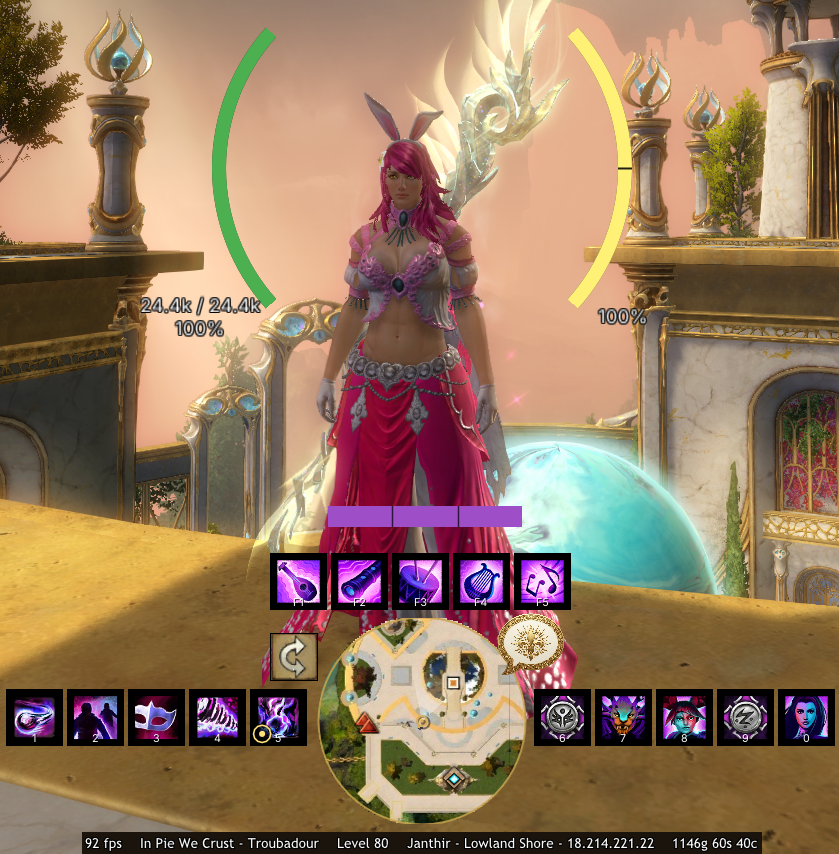

# Pie UI

A [Raidcore Nexus](https://raidcore.gg/Nexus) addon for Guild Wars 2 that replaces native HUD elements with configurable, better-looking alternatives. Pie UI only **reads** game memory — it never writes to or modifies the game. Actions you trigger yourself (casting a clicked skill, sending a chat message, opening the map from a link) use the game's normal input and interface paths, not memory edits or automation.

## AI Notice

This addon has been largely created using Claude. I understand that some folks have a moral, financial or political objection to creating software using an LLM. I just wanted to make a useful tool for the GW2 community, and this was the only way I could do it.

If an LLM creating software upsets you, then perhaps this repo isn't for you. Move on, and enjoy your day.

## Screenshots

## Features

### Player vitals
- HP, barrier, and endurance in four styles: **horizontal bar**, **vertical bar**, **reticle arcs**, and **reticle ring**.
- Live HP/endurance/barrier numbers with a 3-stop HP colour gradient (green → amber → red).
- Barrier shown as a separate strip or overlaid — always visible, even at full HP.
- **Downed warning:** the HP bar turns red with a deep-red border the moment you're downed, whatever your health was.
- **Mount & glider aware:** tracks mount dodge endurance (with per-mount dodge segments) while mounted, the Skyscale's flight stamina, and your **glider stamina** while gliding.
- Every colour is configurable.

### Skill bars
- Live weapon and utility skill icons that follow weapon swaps, kits, transforms, and bundles automatically.
- **Cooldown sweeps** with countdown numbers and grey-out.
- **Click-to-cast** — click a skill to fire it; press-and-hold works for channelled skills (e.g. Siege Turtle jets).
- Keybind labels on each slot, fully rebindable in-app.
- Activation flash and combo/flip animations.
- A **weapon-swap / stow button** that mirrors the native one, with its recharge (and the right behaviour per profession).
- Separate, independently placeable groups for weapons and utilities.

### Profession & pet bars
- **Profession bar** (F1–F7) that auto-fits your specialisation's mechanics.
- **Elementalist attunement highlight** — the active element's F-slot is enlarged with a thick, element-coloured border, matching the native UI.
- **Pet / mech control bar** for Rangers and Mechanists: live pet skills with cooldowns, a creature HP bar, and command buttons (attack, return, swap, combat toggle).
- Optional pet HP readout on the reticle HUD, beside your own health.

### Profession resource bar
A positionable bar for your specialisation's core resource — smooth fill or segmented pips, with a configurable colour per class. Currently covers:
- **Necromancer** — Life Force (all specs).
- **Mesmer** — clones, **Virtuoso** blades, and **Troubadour** notes.
- **Guardian** — **Firebrand** tome pages and **Luminary**'s Radiant Forge.
- **Revenant** — energy, with a recovery/drain **rate indicator**; plus a native-style **legend bar** that shows both legends side by side, the **swap cooldown** on the active legend, and the F1 swap indicator.
- **Conduit** — **Affinity** stacks, shown as pulsing pips beside the energy bar.
- **Warrior** — **Adrenaline**, as segmented bars.
- **Thief** — **Initiative** (all specs), shown as native-style diamond pips; **Specter** adds a **Shadow Force** bar and **Deadeye** a segmented **Malice** bar below the pips.
- **Ranger** — **Galeshot** arrow charges.

### Mounted hotbar
- Per-mount skill layouts with the correct icons and keybind labels, shown automatically while mounted.

### Boon, condition & effect bars
- Three independently placeable sections — **boons**, **conditions**, and **everything else** — showing your live effects.
- Per-section display: icons only, duration bars only, or icons with bars.
- Stack counts, live countdown timers, orientation and wrapping all configurable.

### Target frame
- A positionable bar showing your current target's health percentage.

### Squad & party frames
- A movable, resizable roster panel for your party or squad, styled to match the rest of Pie UI.
- Squads are grouped into colour-coded **subgroup columns** (with labels); parties use a configurable grid.
- Each member shows their **class / elite-spec icon**, **name**, and **commander / lieutenant tag**.
- Your own row is highlighted, and members in another map instance are dimmed.
- Configurable cell size, columns, fonts, and colours.

### Minimap
- A clean, positionable minimap with resource-node markers (herb / wood / ore) sized to gather type.
- Map-completion tinting for mastery insights, pulled live from the GW2 API.
- Correct player position in WvW, where the native compass data falls short.

### Bottom-line strip
- A configurable status strip of live readouts: **FPS**, **memory**, **server ping**, **region / map / coordinates**, **character name and class**, **level**, **mount**, **XP**, your **wallet**, and your **active build / gear** names.
- A **clock** showing in-game **Tyrian** time alongside your **local** and **server** time — display one (click to cycle) or **all three at once**, in 12- or 24-hour format.
- **Multi-currency wallet** — pick which currencies the wallet shows (gold plus any others: Karma, Volatile Magic, Bandit Crests, …), each with its own icon and balance.
- Choose which readouts appear, arrange them left / centre / right, and colour each one.

### Replacement chat box
- A movable, resizable chat panel with a fully **interactive tab strip**: rename tabs, pick which channels each shows (including guilds G1–G6), drag to reorder, and unread `(N)` badges.
- Rich, clickable lines: **URLs**, **waypoint** links that open and pan the world map, **item** links with name, icon and live vendor/trading-post prices, **skill** links with a full tooltip, and **build template** links that open the native build window.
- Real **guild tags** on guild lines, **class/elite-spec icons** and **commander/lieutenant tags** on party/squad members' messages, and **timestamps** (12/24h).
- Per-channel three-colour styling (name / sender / text) and four font-size presets.
- **Sending** built in: an input row with leading slash commands, a channel picker, and **left-click a name to whisper** or right-click for **whisper / invite to party / invite to squad**.

### Tyrian IM — built-in messenger
- A per-contact whisper messenger (an evolution of the standalone Tyrian IM), with a conversation list, chat bubbles, and a reply box.
- An always-visible **floating icon** that bobs, flashes, and shows an unread badge; click it to jump to your unread conversation.
- Multiple visual **themes**, an optional notification **sound**, and per-conversation history saved to disk.
- Right-click a name in the chat box (or use "Whisper") to open the conversation straight away.

### General
- A clean settings window (open via keybind, the quick-access tray icon, or the Nexus options panel) with per-subsystem tabs and colour pickers.
- Drag-to-place and resize any widget in unlock mode, with snap-to-grid.
- **Per-feature opacity** for in-combat and out-of-combat (set to zero to hide a widget entirely).
- **Hide-on-hover** — optionally have a widget fade out for a few seconds while your mouse is over it, so native panels behind it (Hero, Guild, vendors) are visible and clickable.
- Everything hides automatically on loading screens, character select, and the world map.
- Settings persist in a versioned `pieui.json` that survives updates.

## Hiding the native UI

Pie UI draws *replacements*, not overlays that erase the originals. To hide a native element and drop a Pie UI widget in its place, use the game's own **Options → UI → Dynamic HUD** (covers the skill bar, health orb, compass, target, party, chat, and more). This keeps the addon policy-safe and avoids touching the game's render path.

## Installation

Requires the [Nexus](https://raidcore.gg/Nexus) host. Copy `PieUI.dll` into your `<Guild Wars 2>/addons/` folder and (re)load it from the Nexus addon list.

## Roadmap

See [ROADMAP.md](ROADMAP.md) for what's planned and being explored.
